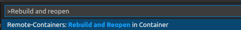
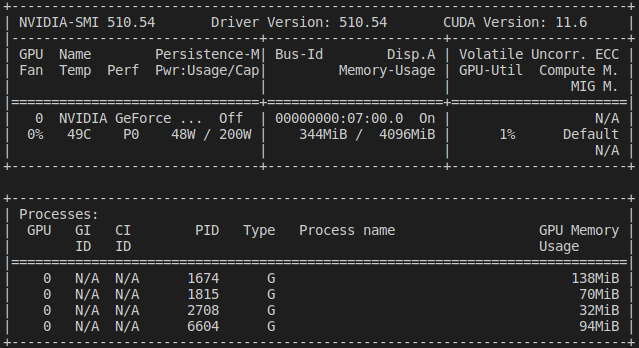

### Abstract

If you have some experience with programming you know how complicated and error prone setup of new dev environment can be, especially if you are using technologies, without built-in package management system (for&nbsp;instance pip or NuGet), like C or C++. When you add more and more dependencies to your project it can be really tough to move it around and onboard new developer to your team.

Imagine that you can pack every dependency into some kind of bag, open it basically everywhere and focus on coding instead of installing everything from scratch.
To achieve above we will utilize Docker containers and VSCode with officially created by Microsoft Remote Containers extension.

### Requirements
* CUDA-enabled host device
* [Docker](https://www.docker.com/)
* [VSCode](https://code.visualstudio.com/)
* [Familiarity with CMake](https://cmake.org/)
* [Remote containers VSCode Extension](https://code.visualstudio.com/docs/remote/containers)
* [Nvidia container toolkit](https://docs.nvidia.com/datacenter/cloud-native/container-toolkit/install-guide.html)

### Remote container setup

First of all, to develop CUDA-enabled application you need proper device with CUDA support and installed [Nvidia&nbsp;container&nbsp;toolkit](https://docs.nvidia.com/datacenter/cloud-native/container-toolkit/install-guide.html) to be able to use Nvidia's GPU from container.
After installing all requirements on your host computer, you can proceed to creation of remote container configuration and finally project.

Right after creating root directory for new project you should create `.devcontainer` directory, next create `devcontainer.json` file inside.
Created in previous step `devcontainer.json` is used to communicate with [remote containers extension](https://code.visualstudio.com/docs/remote/containers) which handles all docker related actions for you.

You're almost there, now put into `devcontainer.json` content below:    
```jsonc
{
    "name": "C++",
    "image": "ghcr.io/ulfsoft-harbour/cuda/sdk-vscode:11.6.0",
    "runArgs": [
        // you have to pass what gpu you wan to CUDA interact with
        "--gpus=all",
        // add capacity and security-opt to enable debugging inside container
        "--cap-add=SYS_PTRACE",
        "--security-opt",
        "seccomp=unconfined"
    ],
    // list contains of all extensions that will be always available inside container
    "extensions": [
        "ms-vscode.cpptools",
        "ms-vscode.cmake-tools",
        "ms-vscode.cpptools-themes",
        "vadimcn.vscode-lldb",
    ],
    "remoteUser": "vscode",
}
```

Once above configuration is ready you can jump into container by selecting `Reopen in container` option from command palette (`Ctrl + Shift + P`) or by clicking in green button in bottom left corner of the VSCode window.    

{: .post-image}
    

After window reload you can test your setup by typing `nvidia-smi` into terminal, expect output to look like this:    

{: .post-image}


When you are sure that container with CUDA is up and running you can start shaping solution.
There are many approaches to manage building, testing and packaging but in this tutorial will be used CMake, *de facto* industry standard, portable and well documented tool from company named Kitware. It's good to use appropriate tools to solve problems it saves your time and makes your life easier, so if you have never used it I highly recommend to get familiar with CMake by reading great introduction available [here](https://cliutils.gitlab.io/modern-cmake/chapters/basics.html).

Once you have your `CMakeLists.txt` files ready adding CUDA can be done in multiple ways utilizing modern CMake.    
If your projects always requires CUDA use:    
```cmake
project(
    project-name
    LANGUAGES CUDA CXX)
```
or use code below if CUDA is optional:    
```cmake
enable_language(CUDA)
```

Now you can select your kit (Clang for instance), configure, build and run your project with CUDA on board.
Happy codding inside container!

### Further reading
Using this knowledge you can go deep and experiment with:
1. [Modern CMake: CUDA](https://cliutils.gitlab.io/modern-cmake/chapters/packages/CUDA.html)