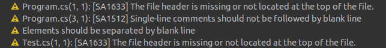
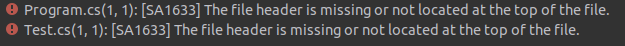

### Abstract

Enforcing single code formatting style is a key to maintain consistent codebase between group of people (and teams too).

### Requirements


### Adding style rules to project the old way

<!-- THIS IS HOW IT WAS B4 EditorConfig -->

First of all you should add [StyleCop.Analyzers](https://github.com/DotNetAnalyzers/StyleCopAnalyzers) nuget to project in which you want to enforce style rules. Next step is to create `stylecop.json` file with JSON schema from [official repo](https://raw.githubusercontent.com/DotNetAnalyzers/StyleCopAnalyzers/master/StyleCop.Analyzers/StyleCop.Analyzers/Settings/stylecop.schema.json). This file should contain:
```json
{
  "$schema": "https://raw.githubusercontent.com/DotNetAnalyzers/StyleCopAnalyzers/master/StyleCop.Analyzers/StyleCop.Analyzers/Settings/stylecop.schema.json"
}
```

Then executing build command should report few code style rule violations

{: .post-image}



You have working setup, now you can define set of rules by creating file with `.ruleset` extension (for instance: `Default.ruleset`) and refer to it in `.csproj` file by adding:
```xml
<PropertyGroup>
    <CodeAnalysisRuleSet>Default.ruleset</CodeAnalysisRuleSet>
</PropertyGroup>
```

Once your project knows about new `.ruleset` file, it's time to define code rules. Fill previously created `.ruleset` file with:
```xml
<?xml version="1.0"?>
<RuleSet Name="Default"
         ToolsVersion="15.0"
         Description="Default action. Rules with IsEnabledByDefault = false are disabled.">
   <Rules AnalyzerId="Microsoft.CodeQuality.Analyzers" RuleNamespace="Microsoft.CodeQuality.Analyzers">
        <Rule Id="SA1633" Action="Error" />
   </Rules>
</RuleSet>
```

Executing build command after enforcing error on rule `SA1633` should fail with build errors

{: .post-image}


<!-- Use EditorConfig -->

### Modern style enforce with EditorConfig

### Further reading

